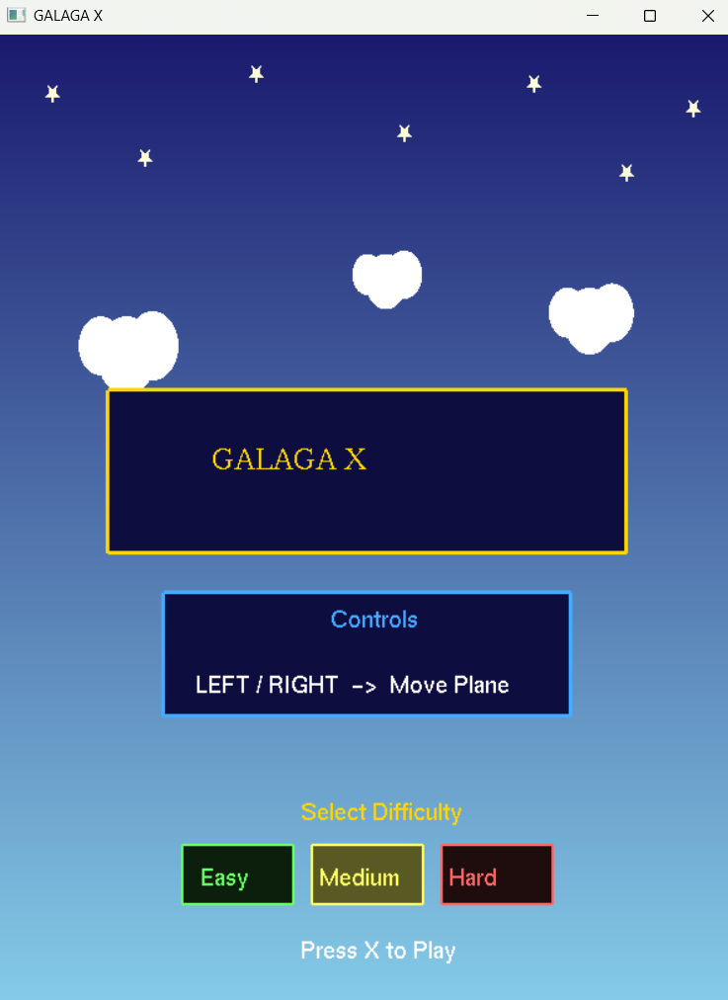
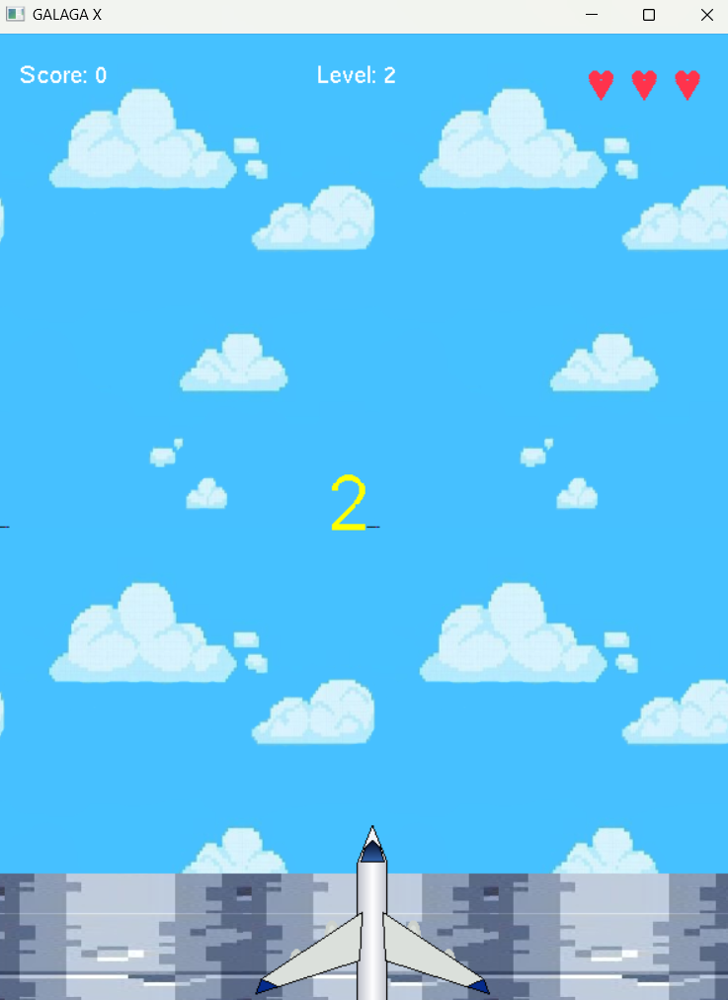
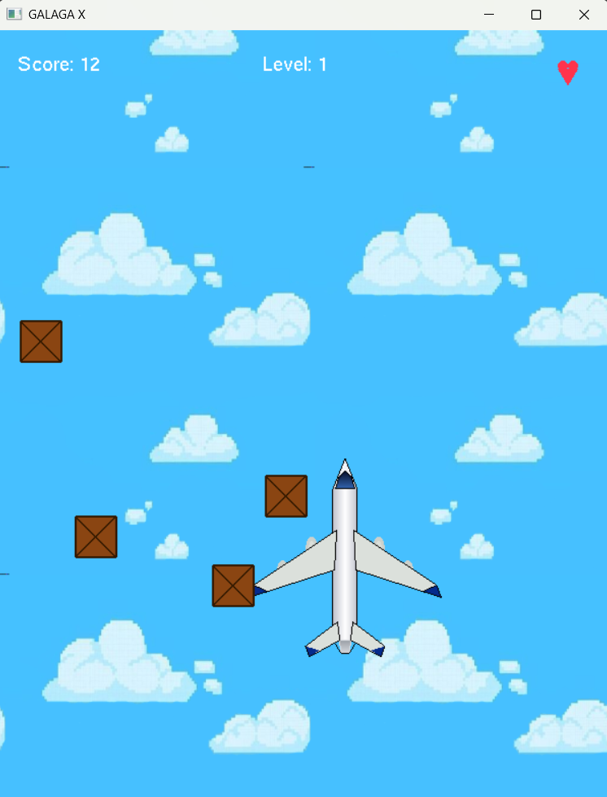

# ✈️ Galaga X (2D OpenGL Game)

  
  
  

A 2D aerial survival and obstacle-avoidance game built with C++ and OpenGL (GLUT). Players control a responsive spaceship to dodge incoming hazards, manage health, and navigate through different difficulty levels.

---

## 🎮 Game Overview & Features

* **Gameplay Mechanics:** Pure survival/dodge mechanics — players maneuver the airplane to dodge falling obstacles (no shooting mechanics).
* **Start Menu:** Interactive UI where players select difficulty levels via Mouse clicks and press **'X'** to launch the game.
* **Level Countdown:** Each stage begins with a paused state during a 3-2-1 countdown before active gameplay starts.
* **Dynamic Hazard System:**
  * **Boxes:** Standard obstacles across all levels. Decreases player health by **1 Heart** upon collision.
  * **Bombs:** High-risk obstacles exclusive to **Hard Mode**. Causes an **Instant Game Over** regardless of remaining health.
  * **Speed Scaling:** Obstacle fall speeds dynamically adjust based on the selected difficulty level.
* **Health System:** The player starts with **3 Hearts**.
* **Game Over & Victory States:** Custom screens with instant retry functionality by pressing **'R'** (restarts the current level).

---

## 🕹️ Controls

| Input | Action |
| :--- | :--- |
| **Mouse Left-Click** | Select Difficulty Level in Main Menu |
| **X Key** | Start Game from Menu |
| **Arrow Keys (Up, Down, Left, Right)** | Control Airplane Movement |
| **R Key** | Retry Current Level (on Victory or Defeat screens) |

---

## 📐 Technical & Graphic Highlights

* **2D Transformations:** Implementation of geometric transformations including Translation (movement), Scaling, and Rotation on game primitives.
* **Matrix Operations:** Utilization of isolated matrix stacks (`glPushMatrix` / `glPopMatrix`) for independent object behavior.
* **Custom UI & Fonts:** Stroke-font rendering for countdown timers, score displays, and custom overlay screens.
* **State Management:** Frame-by-frame state handling for countdowns, level transitions, and win/loss conditions.

---

## 🛠️ Built With

* **Language:** C++
* **Graphics Library:** OpenGL / GLUT 

---

## ✈️ How to Run

1. Open the project solution in your C++ IDE (e.g., Visual Studio configured with OpenGL/GLUT).
2. Ensure image assets are placed correctly within the project working directory (`Assets/`).
3. Compile and Run the project (`Source.cpp`).

---

## 💡 Academic & Project Context

> **Note:** This project was developed as a course project within a constrained timeframe. While created under academic workload pressure, it successfully implements all required Computer Graphics concepts, 2D transformations, and core game logic features effectively.

---

## 👥 Team Contributions

* **Daniah Hadi:** Implemented 2D transformation modules (Rotation & Scaling), contributed to initial code integration, developed the UI countdown timer, and designed the Game Over logic.
* **Yara Alsulami:** [@s4k4hkq49m-creator] Designed the airplane's wings and tail primitives, engineered the Victory Screen UI, and enhanced overall player model visual dynamics.
* **Ryoof Alahmari:** Rendered the airplane's core structure (fuselage, nose cone) and applied geometric shading for improved 2D graphics depth.
* **Rafah Asharif:** Developed the dynamic 2D obstacle generation system, managed scene lighting, and implemented the hearts-based health system.
* **Wasan Alwafi:** Designed and implemented the Interactive Main Menu & Start Screen, including mouse-click event handling, level selection interface, and game initiation logic.
* **Riham Wan-Deraman:** Processed and edited external image assets for OpenGL texture mapping; modified the sky background image for seamless repeating and color consistency, and re-aligned the runway material image into a symmetric texture.
